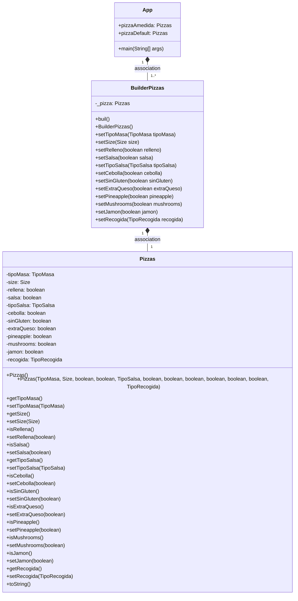
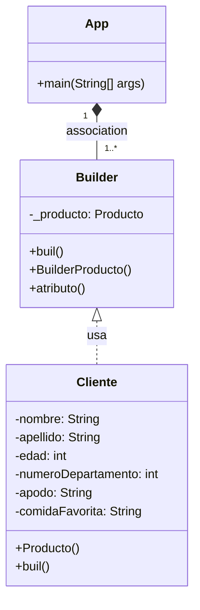

## Función del Patrón Builder:
Este patrón nos va a ayudar a construir nuestro objeto final en pequeños pasos. De manera, que utilizaremos solo lo que necesitamos para nuestro objeto.

### Ejemplo:
Imagina que tenemos una clase Usuario, la cual tiene los siguientes atributos: 
```
private String nombre;
private String apellido;
private int edad;
private int numeroDepartamento;
private String apodo;
private String comidaFavorita;
```

El Cliente necesita una instancia de la clase Producto pero, si observas bien, el constructor de Producto no tiene ningún modificador de acceso. Eso quiere decir que Producto solo puede ser construido desde clases que se encuentran en el mismo paquete. Lo más seguro es que Cliente se encuentre en un paquete distinto al de Producto.

Builder está en una situación similar a Producto, tiene un constructor sin modificador de acceso. Lo único con lo que cuenta Builder es con una serie de métodos que permiten establecer los valores de los atributos de Producto, representados en el diagrama con el método atributo (el cual en la implementación será reemplazado por cada uno de los nombres de los atributos de la clase Producto), y un método build que regresa una instancia de Producto con los valores establecidos.

Así que, el Cliente necesita del Builder para crear una instancia de Producto, pero no se puede crear una instancia de Builder directamente. ¿Qué podemos hacer en este caso? Bien, la solución se encuentra en la clase Producto, tiene un método estático, builder que regresa una nueva instancia de Builder. Con esta instancia podemos comenzar la construcción, la cual sería algo así: 
```
Builder builder = Producto.builder();
Producto producto = builder.nombre("...").precio(0.0).categoria("...").build();
```
Los métodos nombre, precio y categoria son los que reemplazan el método atributo en el diagrama del patrón.

En este ejemplo el Builder es una clase concreta, pero bien podría ser una interface. Esto daría la ventaja de que no necesariamente debemos usar siempre la misma clase Builder, podríamos (a través de un patrón Factory) utilizar diferentes Builders dependiendo de distintas condiciones o situaciones.

Este patrón tiene la ventaja de que podemos extenderlo para guiar la construcción de objetos complejos.
Pensemos que tenemos una clase Usuario que tiene una Direccion y varios Telefonos asociados, algo similar a esto:


```
public class Usuario {  
 
    private String nombre; 
    private String username; 
    private int edad; 
    private String password;
 
    Usuario(UsuarioBuilder builder) {
        this.nombre = builder.getNombre();
        this.username = builder.getUsername();
        this.edad = builder.getEdad();
        this.password = builder.getPassword();
    }
     
    public static UsuarioBuilder builder(){
        return new UsuarioBuilder();
    }
}
 
public class UsuarioBuilder {
    private String nombre; 
    private String username; 
    private int edad; 
    private String password;
 
    UsuarioBuilder() {
 
    }
 
    public Usuario build() {
        Usuario usuario = new Usuario(this);
        return usuario;
    }
}
```
Y lo usaríamos de la siguiente forma: 
```
Usuario usuario = Usuario.builder()
    .edad(30)
    .username("javatutoriales")
    .nombre("Programador Java")
    .password("123456789")
    .build();
```
Con Builder incluso podemos forzar el que se establezcan los atributos obligatorios. Digamos que los campos nombre y username del Usuario son obligatorios. Lo único que debemos hacer es solicitarlos en el constructor de UsuarioBuilder:
```
UsuarioBuilder(String nombre, String username) {
    this.nombre = nombre;
    this.username = username;
}
```
Y lo usaríamos de esta forma: 
```
Usuario usuario = Usuario.builder("Programador Java", "javatutoriales")
    .edad(30) 
    .password("123456789")
    .build();
```
